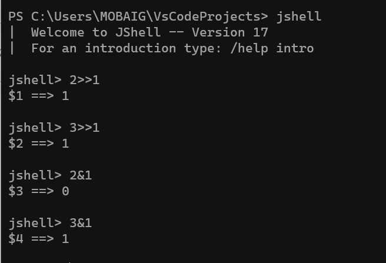

[289. Game of Life](https://leetcode.com/problems/game-of-life/)

According to Wikipedia's article: "The Game of Life, also known simply as Life, is a cellular automaton devised by the British mathematician John Horton Conway in 1970."

The board is made up of an m x n grid of cells, where each cell has an initial state: live (represented by a 1) or dead (represented by a 0). Each cell interacts with its eight neighbors (horizontal, vertical, diagonal) using the following four rules (taken from the above Wikipedia article):

Any live cell with fewer than two live neighbors dies as if caused by under-population.
Any live cell with two or three live neighbors lives on to the next generation.
Any live cell with more than three live neighbors dies, as if by over-population.
Any dead cell with exactly three live neighbors becomes a live cell, as if by reproduction.
The next state is created by applying the above rules simultaneously to every cell in the current state, where births and deaths occur simultaneously. Given the current state of the m x n grid board, return the next state.


```text
Input: board = [[0,1,0],[0,0,1],[1,1,1],[0,0,0]]
Output: [[0,0,0],[1,0,1],[0,1,1],[0,1,0]]
```


```text
Input: board = [[1,1],[1,0]]
Output: [[1,1],[1,1]]
```

### Approach - 1    (simulate using extra space)

- Time Complexity: (8 * (N*M)) => (N*M)
- Space Complexity: O(N*M)

```java
class Solution {
    
    private final int[][] directions = new int[][] {
            {-1,0}, {0,1}, {1,0}, {0,-1},   // north east south west
            {-1,1}, {1,1}, {1,-1}, {-1,-1}  // other 4 directions
        };
    
    public void gameOfLife(int[][] board) {
        int n = board.length, m = board[0].length;
        
        int[][] result = new int[n][m];
        
        for(int i=0;i<n;i++) {
            for(int j=0;j<m;j++) {
                result[i][j] = calculate(board, i, j);
            }
        }
        
        for(int i=0;i<n;i++) {
            for(int j=0;j<m;j++) {
                board[i][j] = result[i][j];
            }
        }
        
    }
    
    private int calculate(int[][] board, int i, int j) {
        int liveCells = 0, deadCells = 0;
        
        for(int[] dir: directions) {
            int x = i+dir[0], y = j+dir[1];
            if(!outOfBounds(board, x, y)) {
                if(board[x][y] == 0) {
                    deadCells++;
                } else {
                    liveCells++;
                }
            }
        }
        // System.out.printf("%s,%s\n",liveCells,deadCells);
        if(board[i][j] == 1) {
            if(liveCells < 2) {
                return 0;
            } else if(liveCells > 3) {
                return 0;
            } else {
                return 1;
            }
            
        } else {
            return liveCells == 3 ? 1 : board[i][j];
        }
        
    }
    
    private boolean outOfBounds(int[][] board, int i, int j) {
        return (i<0 || i>= board.length || j<0 || j>=board[i].length);
    }
    
    
}
```

### Approach - 2 (Bit manipulation)

1. Traverse the array, find number of alive neighbours for each cell.
2. As per the question statement, if current cell is 0 and neighbour alive cells = 3, then update the current cell to 2 (instead of one, in binary 2 = 10)
3. if current cell is 1 and neighbour alive cells = 2 or 3, then update current cell to 3 (instead of one, in binary 3 = 11)
4. we are temporarily marking these values as 2,3. If we right shit 2,3 we will get 1 (result we wanted). If we do (2 & 1) = 0, (3 & 1) = 1, we will get our previous state of cell. 
5. Notice that we have worked on cases only where value may be updated to 1. we should leave cases which will result in 0.
6. in order to get the result all cell values should be right shifted by one place. The cells with values 2,3 will give 1, and other cells will give 0.

- Time Complexity: O(N*M)
- Space Complexity: O(N*M)



```java
private static final int[][] DIRS = {{-1, -1}, // top-left
 									 {-1, 0},  // top
									 {-1, 1},  // top-right
									 {0, -1},  // left
									 {0, 1},   // right
									 {1, -1},  // bottom-left
									 {1, 0},   // bottom
									 {1, 1}};  // bottom-right

public void gameOfLife(int[][] board) {
	var rows = board.length;
	var cols = board[0].length;
	playGame(board, rows, cols);
	updateBoard(board, rows, cols);
}

private void playGame(int[][] board, int rows, int cols) {
	for (var i = 0; i < rows; i++)
		for (var j = 0; j < cols; j++) {
			var alive = aliveNeighbors(board, rows, cols, i, j);
			// Dead cell with 3 live neighbors becomes alive
			if (board[i][j] == 0 && alive == 3) // board[i][j] = 00
				board[i][j] = 2; // board[i][j] = 10
			// Live cell with 2 or 3 live neighbors lives on
			else if (board[i][j] == 1 && (alive == 2 || alive == 3)) // board[i][j] = 01
				board[i][j] = 3; // board[i][j] = 11
		}
}

private int aliveNeighbors(int[][] board, int rows, int cols, int i, int j) {
	var alive = 0;
	for (var dir : DIRS) {
		var neighborX = i + dir[0];
		var neighborY = j + dir[1];
		if (!isOutOfBounds(rows, cols, neighborX, neighborY))
			alive += board[neighborX][neighborY] & 1;   // this will return one only if pervious state is one.
	}
	return alive;
}

private boolean isOutOfBounds(int rows, int cols, int x, int y) {
	return x < 0 || x >= rows || y < 0 || y >= cols;
}

private void updateBoard(int[][] board, int rows, int cols) {
	for (var i = 0; i < rows; i++)
		for (var j = 0; j < cols; j++)
			board[i][j] >>= 1; // right shift 1 bit to replace old state with new state
}
```